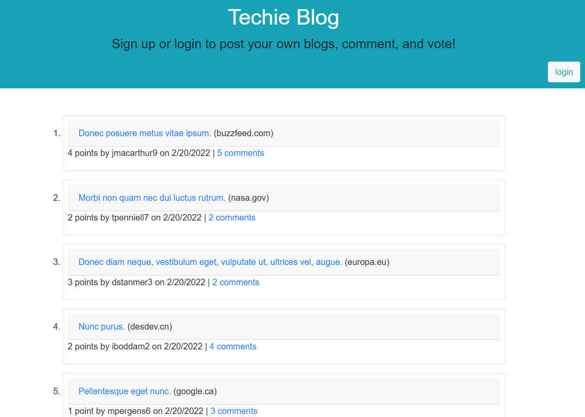
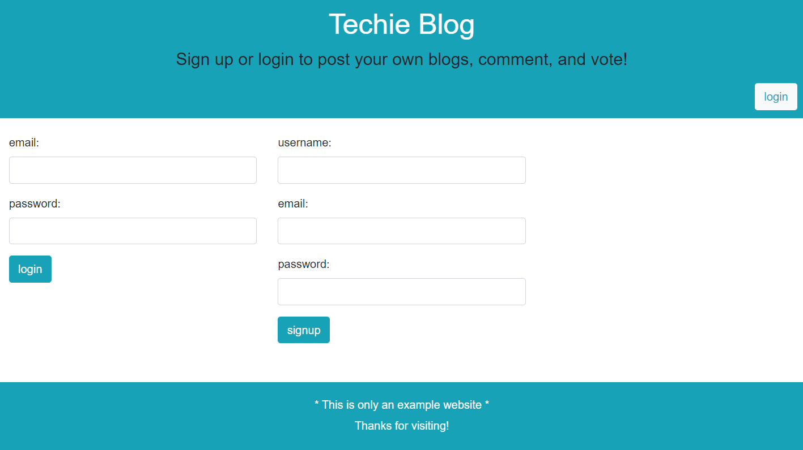
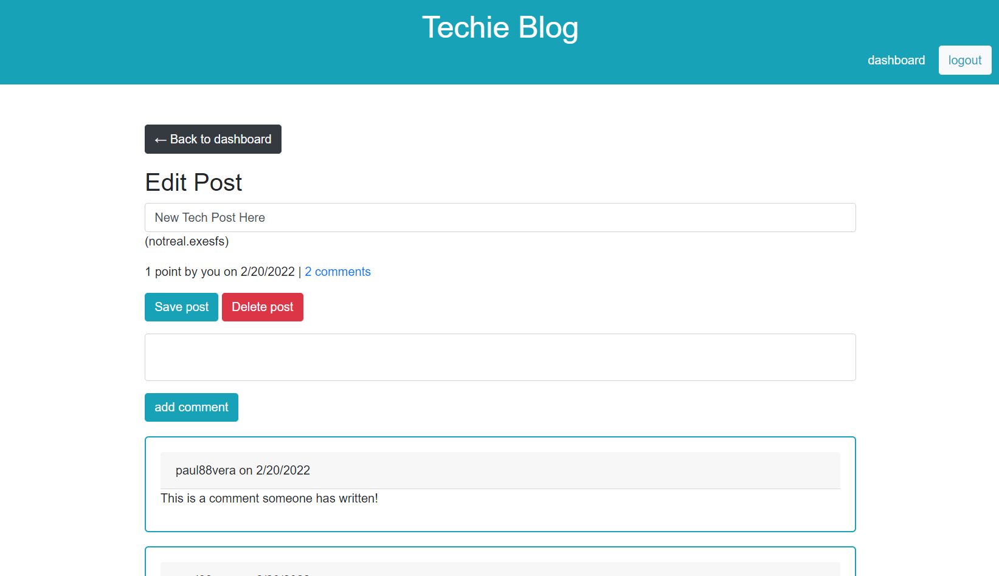

  # Techie Blog





  ## Description
  Techie Blog is a website template for creating blog posts. It also allows commenting and voting.

  ## Table of Contents
  - [Installation](#installation)
  - [Usage](#usage)
  - [License](#license)
  - [Contributing](#contributing)
  - [Tests](#tests)
  - [Questions](#questions)

  ## Installation
  Follow the link provided and start using Tech Blog on a Heroku cloud-based server:
  [View Website on Heroku](https://aqueous-depths-39284.herokuapp.com/)

  ## Usage
  Techie Blog is a great starting template to create a blog based site with login authorization and password encryption.

  ## License
  License under [](https://opensource.org/licenses/MIT) license

  ## Contributing
  This was an end-to-end website.

  ## Tests
  * On the website, create a user account, create a new post, comment on a post, vote on a post, and try deleting your post.
  * If you downloaded the repository files, use the following code to test:
  ```
  $ npm i
  $ npm run test
  ```
  The `helpers.tests.js` will run and pass all formatting tests if working correctly.
  
----
  ## Questions
  If you have questions, you can contact me below!
  
  GitHub Username: paul88vera

  GitHub Profile: [Github.com/paul88vera](https://github.com/paul88vera/)

  Email Address: paul88vera@gmail.com
 